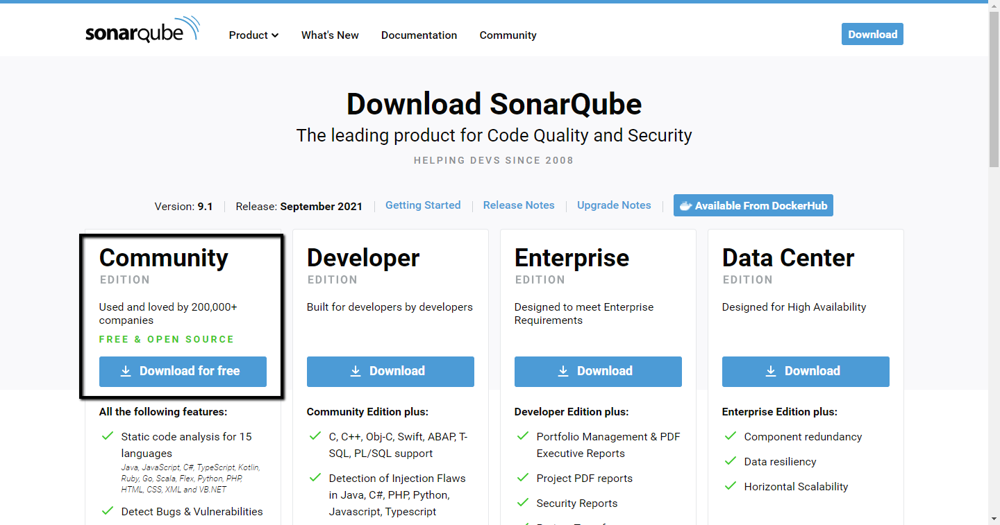
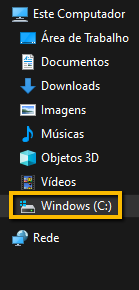
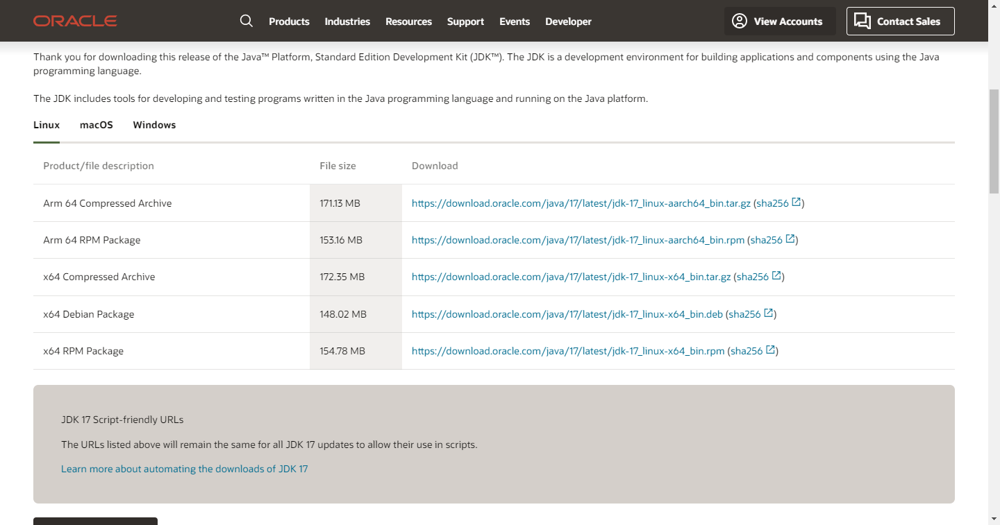
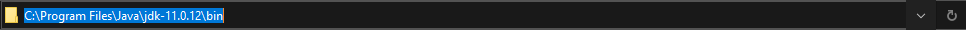
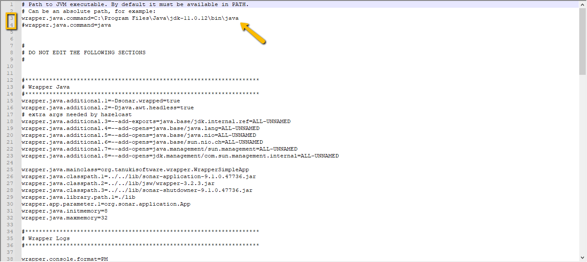
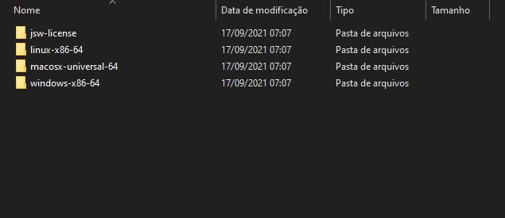
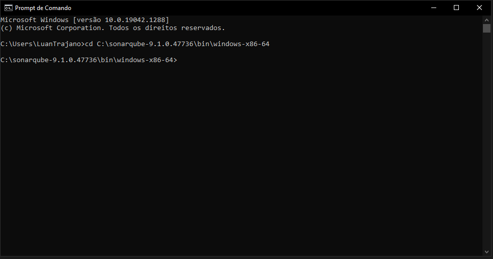
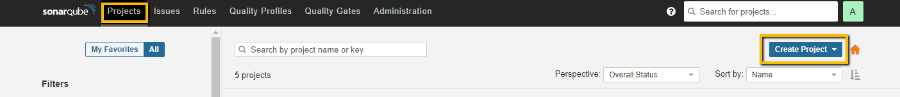
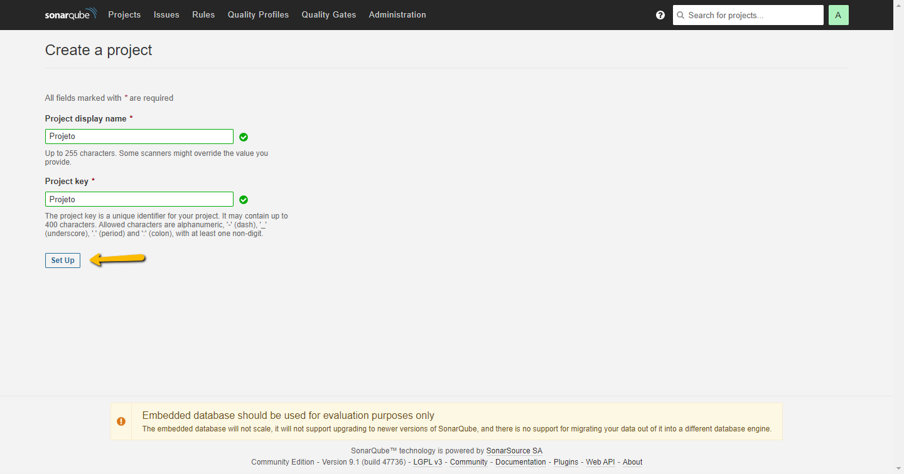
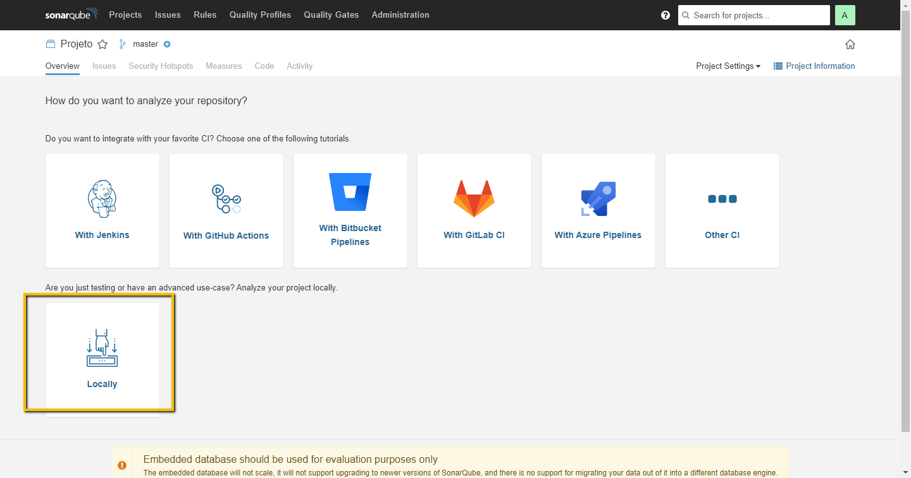

# PASSOS PARA RODAR SonarQube LOCALMENTE

1. Primeiro passo configuração SonarQube... 

* Deve baixar o SonarQube no site (https://www.sonarqube.org/downloads/), baixar a versão Community;

* Depois de baixar o arquivo vai estar compactado, deve ser extraido no windows (C:);

* Em seguida vai o java no site (https://www.oracle.com/java/technologies/downloads/), onde deve ser feito o download de acordo com o sisteman operacional;

* Deve pegar o caminho da pasta bin do Java geralmente é (C:\Program Files\java\jdk-{versão}\bin), a versão é de acordo com a que foi baixada;

* Em seguida deve ir na pasta do SonarQube em conf e no arquivo com botão direito preciosar para editar, ao abrir o arquivo deve comentar (#) a quarta linha, e descomentar a treceira linha (removendo o #) e na mesma colocar o caminho da pasta bin do java;

* Logo depois de todos esses passos, entrar na pasta do SonarQube no (C), e na pasta bin, e escolher a pasta de acordo com o sistema operacional usado;

* Em seguida deve pegar o caminho novamente e abrir o cmd e passar para abrir ser aberto dentro da pasta;

* Então execultar o comando StartSonar.bat para subir na porta:localhost:9000/about; * obs: Caso de erro reiniciar a maquina e tentar novamente; 

2. Segundo passo Criação do projeto no localhost:9000/about;

* Assim que o servidor subir e a pagina for carregada, deve clicar em Projects e em create Project, selecione Manually;

* Em seguida coloque o nome do projeto e precione Set Up;

* Quando carregar a tela selecione 'Locally';

* Coloque uma palavra para gerar o token;

  
* Clique em continuar e escolha o opção .Net Core;

* Execute os comando dentro do diretorio pelo cmd, no projeto onde sera feito os teste;

* Por fim voltando ao menu em Projects podemos ver o teste execultado...

